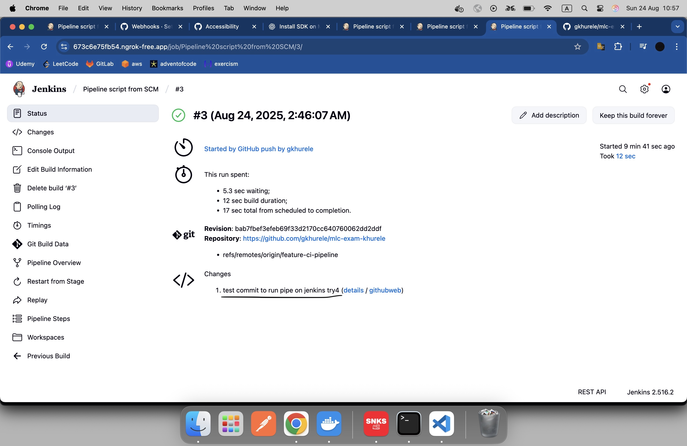

# CI/CD Pipeline Товч Танилцуулга

Энэ repository нь GitHub Actions ба Jenkins ашиглан тестүүдийг branch-аас хамааран ажиллуулах тохиргоотой.

## Branch-ийн Workflow

1. **develop branch**
   - **Trigger:** `develop` branch руу push хийх үед
   - **Action:** **Unit тестүүдийг** ажиллуулна
   - **GitHub Actions Workflow:** `.github/workflows/dotnet-develop.yml`

2. **staging branch**
   - **Trigger:** `staging` branch руу push хийх үед
   - **Action:** **Integration тестүүдийг** ажиллуулна
   - **GitHub Actions Workflow:** `.github/workflows/dotnet-staging.yml`

3. **feature-ci-pipeline branch**
   - **Trigger:** `feature-ci-pipeline` branch руу push хийх үед
   - **Action:** Jenkins дээр **Unit болон Integration тестүүдийг хоёуланг нь** ажиллуулна
   - **Jenkins тохиргоо:**
     - `Dockerfile` – Local PC дээр Docker ашиглан Jenkins image үүсгэхэд ашиглана.
     - `Jenkinsfile` – Jenkins дээр ажиллах pipeline script. Jenkins дээр **"Pipeline script from SCM"** ашиглан pipeline үүсгэсэн.
   - **Jenkins-ийн олон нийтэд нээлттэй хаяг:**  
     [https://673c6e75fb54.ngrok-free.app/](https://673c6e75fb54.ngrok-free.app/) – `localhost:8080` дээр ажиллаж байгаа Jenkins-ийн public хаяг (ngrok ашигласан).
   - **Webhook тохиргоо GitHub дээр:**  
     [Webhook тохиргоо](https://github.com/gkhurele/mlc-exam-khurele/settings/hooks) – Push event гарахад Jenkins pipeline автоматаар ажиллахад ашиглана.

## Анхаарах зүйлс

- Local Jenkins туршилтад `ngrok` ашиглан `localhost`-ийг олон нийтэд нээж, webhook-ийг ажиллуулсан.
- Local PC дээрээ `localhost:8080` дээр ажиллаж байгаа Jenkins-ээ унтраасан үед [https://673c6e75fb54.ngrok-free.app/](https://673c6e75fb54.ngrok-free.app/) хаягаар хандах боломжгүй.  
  Тиймээс амжилттай ажилласан Jenkins pipeline-ийн screenshot-ыг README-д оруулав.
  
- Feature-CI-Pipeline файлыг Jenkins дээр гараар pipeline ажиллуулж туршихдаа хэрэглэсэн.
